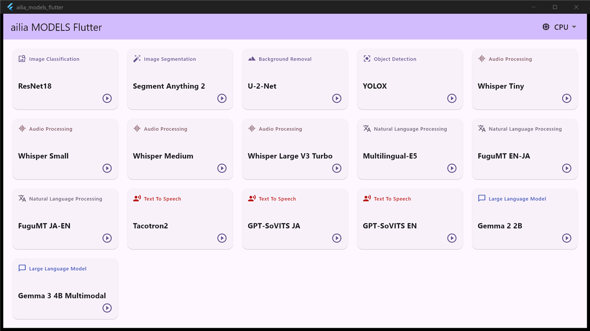

# ailia MODELS Flutter

A model library for flutter.



## Supported Devices

- Windows (x64 / arm64)
- macOS (arm64)
- Android
- iOS

## Requirements

- flutter 3.44.6
- Android Studio 2025.2.2

## Install and Run

```
git clone https://github.com/ailia-ai/ailia-models-flutter.git
flutter pub get
flutter run
```

## Models

### Speech To Text

| | Model | Exported From | Supported Ailia Version | Blog |
|:-----------|------------:|:------------:|:------------:|:------------:|
| [whisper](lib/audio_processing/) | [Whisper](https://github.com/openai/whisper) | Pytorch | 1.2.10 and later | [JP](https://tech.ailia.ai/whisper-%E6%97%A5%E6%9C%AC%E8%AA%9E%E3%82%92%E5%90%AB%E3%82%8099%E8%A8%80%E8%AA%9E%E3%82%92%E8%AA%8D%E8%AD%98%E3%81%A7%E3%81%8D%E3%82%8B%E9%9F%B3%E5%A3%B0%E8%AA%8D%E8%AD%98%E3%83%A2%E3%83%87%E3%83%AB-b6e578f55c87) |
| [sensevoice](lib/audio_processing/) | [SenseVoice](https://github.com/FunAudioLLM/SenseVoice) | Pytorch | 1.5.0 and later | [JP](https://tech.ailia.ai/sensevoice-%E6%97%A5%E6%9C%AC%E8%AA%9E%E3%81%AB%E3%82%82%E5%AF%BE%E5%BF%9C%E3%81%97%E3%81%9F%E9%AB%98%E9%80%9F%E3%81%AA%E9%9F%B3%E5%A3%B0%E8%AA%8D%E8%AD%98%E3%83%A2%E3%83%87%E3%83%AB-3721c79e0592/) |

### Image Classification

| | Model | Exported From | Supported Ailia Version | Blog |
|:-----------|------------:|:------------:|:------------:|:------------:|
| [resnet18](/lib/image_classification/) | [ResNet18]( https://pytorch.org/vision/main/generated/torchvision.models.resnet18.html) | Pytorch | 1.2.8 and later | |

### Image Segmentation

| | Model | Exported From | Supported Ailia Version | Blog |
|:-----------|------------:|:------------:|:------------:|:------------:|
| [sam2](/lib/image_segmentation/segment-anything-2) | [Segment Anything 2](https://github.com/facebookresearch/sam2) | Pytorch | 1.2.16 and later | [JP](https://tech.ailia.ai/segmentanyhing2-%E5%8B%95%E7%94%BB%E3%81%AB%E5%AF%BE%E5%BF%9C%E3%81%97%E3%81%9F%E4%BB%BB%E6%84%8F%E7%89%A9%E4%BD%93%E3%81%AE%E3%82%BB%E3%82%B0%E3%83%A1%E3%83%B3%E3%83%86%E3%83%BC%E3%82%B7%E3%83%A7%E3%83%B3%E3%83%A2%E3%83%87%E3%83%AB-425ff2ae14a4/) |
| [sam3.1](/lib/image_segmentation/segment-anything-3.1) | [Segment Anything 3](https://github.com/facebookresearch/sam3) | Pytorch | 1.6.0 and later | |

### Background Removal

| | Model | Exported From | Supported Ailia Version | Blog |
|:-----------|------------:|:------------:|:------------:|:------------:|
| [u2net](/lib/background_removal/u2net) | [U-2-Net](https://github.com/NathanUA/U-2-Net) | Pytorch | 1.1 and later | |

### Large Language model

| | Model | Exported From | Supported Ailia Version | Blog |
|:-----------|------------:|:------------:|:------------:|:------------:|
| [gemma2](/lib/large_language_model/) | [gemma-2-2b](https://huggingface.co/google/gemma-2-2b) | llama.cpp | 1.1.0 and later| |
| [gemma3-multimodal](/lib/large_language_model/) | [gemma-3-4b-it](https://huggingface.co/google/gemma-3-4b-it) | llama.cpp | 1.4.2 and later | |
| [gemma4-e2b](/lib/large_language_model/) | [gemma-4-E2B-it](https://huggingface.co/google/gemma-4-E2B-it) | llama.cpp | 1.4.2 and later | |

### Natural Language Processing

| | Model | Exported From | Supported Ailia Version | Blog |
|:-----------|------------:|:------------:|:------------:|:------------:|
|[multilingual-e5](/lib/natural_language_processing/) | [multilingual-e5-base](https://huggingface.co/intfloat/multilingual-e5-base) | Pytorch | 1.2.15 and later | [JP](https://tech.ailia.ai/multilingual-e5-%E5%A4%9A%E8%A8%80%E8%AA%9E%E3%81%AE%E3%83%86%E3%82%AD%E3%82%B9%E3%83%88%E3%82%92embedding%E3%81%99%E3%82%8B%E6%A9%9F%E6%A2%B0%E5%AD%A6%E7%BF%92%E3%83%A2%E3%83%87%E3%83%AB-71f1dec7c4f0) |
|[fugumt-en-ja](/lib/natural_language_processing/) | [Fugu-Machine Translator](https://github.com/s-taka/fugumt)   | Pytorch | 1.2.9 and later | [JP](https://tech.ailia.ai/fugumt-%E8%8B%B1%E8%AA%9E%E3%81%8B%E3%82%89%E6%97%A5%E6%9C%AC%E8%AA%9E%E3%81%B8%E3%81%AE%E7%BF%BB%E8%A8%B3%E3%82%92%E8%A1%8C%E3%81%86%E6%A9%9F%E6%A2%B0%E5%AD%A6%E7%BF%92%E3%83%A2%E3%83%87%E3%83%AB-46b839c1b4ae) |
|[fugumt-ja-en](/lib/natural_language_processing/) | [Fugu-Machine Translator](https://github.com/s-taka/fugumt)   | Pytorch | 1.2.10 abd later |

### Object Detection

| | Model | Exported From | Supported Ailia Version | Blog |
|:-----------|------------:|:------------:|:------------:|:------------:|
|[yolox](/lib/object_detection/) | [YOLOX](https://github.com/Megvii-BaseDetection/YOLOX) | Pytorch | 1.2.6 and later | [EN](https://tech.ailia.ai/en/yolox-object-detection-model-exceeding-yolov5-d6cea6d3c4bc/) [JP](https://tech.ailia.ai/yolox-yolov5%E3%82%92%E8%B6%85%E3%81%88%E3%82%8B%E7%89%A9%E4%BD%93%E6%A4%9C%E5%87%BA%E3%83%A2%E3%83%87%E3%83%AB-e9706e15fef2) |
|[detic](/lib/object_detection/) | [Detecting Twenty-thousand Classes using Image-level Supervision](https://github.com/facebookresearch/Detic) | Pytorch | 1.2.10 and later | [EN](https://medium.com/p/49cba412b7d4) [JP](https://tech.ailia.ai/detic-21k%E3%82%AF%E3%83%A9%E3%82%B9%E3%82%92%E9%AB%98%E7%B2%BE%E5%BA%A6%E3%81%AB%E3%82%BB%E3%82%B0%E3%83%A1%E3%83%B3%E3%83%86%E3%83%BC%E3%82%B7%E3%83%A7%E3%83%B3%E3%81%A7%E3%81%8D%E3%82%8B%E7%89%A9%E4%BD%93%E6%A4%9C%E5%87%BA%E3%83%A2%E3%83%87%E3%83%AB-1b8f777ee89a) |

### Object Tracking

| | Model | Exported From | Supported Ailia Version | Blog |
|:-----------|------------:|:------------:|:------------:|:------------:|
|[bytetrack](/lib/object_tracking/) | [ByteTrack](https://github.com/ifzhang/ByteTrack) | ailia Tracker | 1.6.0 and later | |

### Pose Estimation

| | Model | Exported From | Supported Ailia Version | Blog |
|:-----------|------------:|:------------:|:------------:|:------------:|
|[lw-human-pose](/lib/pose_estimation/) | [Lightweight OpenPose](https://github.com/Daniil-Osokin/lightweight-human-pose-estimation.pytorch) | Pytorch | 1.2.1 and later | [JP](https://tech.ailia.ai/lightweighthumanpose-%E9%AB%98%E9%80%9F%E3%81%AB%E9%AA%A8%E6%A0%BC%E6%A4%9C%E5%87%BA%E3%82%92%E8%A1%8C%E3%81%86%E6%A9%9F%E6%A2%B0%E5%AD%A6%E7%BF%92%E3%83%A2%E3%83%87%E3%83%AB-2f2b229ada4b) |

### Text To Speech

| Name | Detail | Exported From | Supported Ailia Version | Blog |
|:-----------|------------:|:------------:|:------------:|:------------:|
| [tacotron2](/lib/text_to_speech/) | [Tacotron2](https://github.com/NVIDIA/tacotron2) | Pytorch | 1.2.15 and later | [JP](https://tech.ailia.ai/tacotron2-%E6%B3%A2%E5%BD%A2%E5%A4%89%E6%8F%9B%E3%82%92ai%E3%81%A7%E8%A1%8C%E3%81%86%E9%AB%98%E5%93%81%E8%B3%AA%E3%81%AA%E9%9F%B3%E5%A3%B0%E5%90%88%E6%88%90%E3%83%A2%E3%83%87%E3%83%AB-bc592217a399) |
| [gpt-sovits](/lib/text_to_speech/) | [GPT-SoVITS](https://github.com/RVC-Boss/GPT-SoVITS) | Pytorch | 1.4.0 and later | [JP](https://tech.ailia.ai/gpt-sovits-%E3%83%95%E3%82%A1%E3%82%A4%E3%83%B3%E3%83%81%E3%83%A5%E3%83%BC%E3%83%8B%E3%83%B3%E3%82%B0%E3%81%A7%E3%81%8D%E3%82%8B0%E3%82%B7%E3%83%A7%E3%83%83%E3%83%88%E3%81%AE%E9%9F%B3%E5%A3%B0%E5%90%88%E6%88%90%E3%83%A2%E3%83%87%E3%83%AB-2212eeb5ad20) |

## Import ailia SDK

This repository automatically downloads the ailia SDK.

When integrating the ailia SDK into a new application, add the following to pubspec.yaml.

```
  ailia:
    git:
      url: https://github.com/ailia-ai/ailia-sdk-flutter.git
      ref: main

  ailia_audio:
    git:
      url: https://github.com/ailia-ai/ailia-audio-flutter.git
      ref: main

  ailia_tokenizer:
    git:
      url: https://github.com/ailia-ai/ailia-tokenizer-flutter.git
      ref: main

  ailia_speech:
    git:
      url: https://github.com/ailia-ai/ailia-speech-flutter.git
      ref: main

  ailia_voice:
    git:
      url: https://github.com/ailia-ai/ailia-voice-flutter.git
      ref: main

  ailia_llm:
    git:
      url: https://github.com/ailia-ai/ailia-llm-flutter.git
      ref: main

  ailia_tracker:
    git:
      url: https://github.com/ailia-ai/ailia-tracker-flutter.git
      ref: main
```

Also, for macOS, it is necessary to set com.apple.security.app-sandbox to false in macos/Runner/Release.entitlements and macos/Runner/Debug.entitlements.
