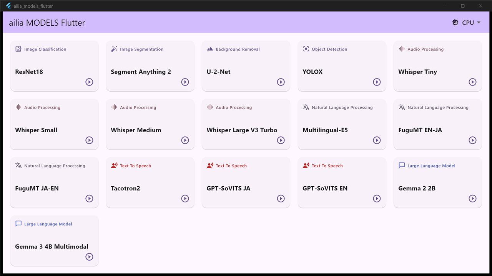

# ailia MODELS Flutter

A model library for flutter.



## Supported Devices

- Windows (x64 / arm64)
- macOS (arm64)
- Android
- iOS

## Requirements

- flutter 3.44.6
- Android Studio 2025.2.2

## Install and Run

```
git clone https://github.com/ailia-ai/ailia-models-flutter.git
flutter pub get
flutter run
```

## Models

### Speech To Text

| | Model | Exported From | Supported Ailia Version | Blog |
|:-----------|------------:|:------------:|:------------:|:------------:|
| [whisper](lib/audio_processing/) | [Whisper](https://github.com/openai/whisper) | Pytorch | 1.2.10 and later | [JP](https://tech.ailia.ai/whisper-%E6%97%A5%E6%9C%AC%E8%AA%9E%E3%82%92%E5%90%AB%E3%82%8099%E8%A8%80%E8%AA%9E%E3%82%92%E8%AA%8D%E8%AD%98%E3%81%A7%E3%81%8D%E3%82%8B%E9%9F%B3%E5%A3%B0%E8%AA%8D%E8%AD%98%E3%83%A2%E3%83%87%E3%83%AB-b6e578f55c87) |
| [sensevoice](lib/audio_processing/) | [SenseVoice](https://github.com/FunAudioLLM/SenseVoice) | Pytorch | 1.5.0 and later | [JP](https://tech.ailia.ai/sensevoice-%E6%97%A5%E6%9C%AC%E8%AA%9E%E3%81%AB%E3%82%82%E5%AF%BE%E5%BF%9C%E3%81%97%E3%81%9F%E9%AB%98%E9%80%9F%E3%81%AA%E9%9F%B3%E5%A3%B0%E8%AA%8D%E8%AD%98%E3%83%A2%E3%83%87%E3%83%AB-3721c79e0592/) |

### Image Classification

| | Model | Exported From | Supported Ailia Version | Blog |
|:-----------|------------:|:------------:|:------------:|:------------:|
| [resnet50](/lib/image_classification/) | [ResNet50]( https://pytorch.org/vision/main/generated/torchvision.models.resnet50.html) | Pytorch | 1.2.8 and later | |
| [vit](/lib/image_classification/) | [Vision Transformer](https://github.com/google-research/vision_transformer) | Pytorch | 1.2.5 and later | [JP](https://tech.ailia.ai/vision-transformer-%E6%9C%80%E5%85%88%E7%AB%AF%E3%81%AE%E7%94%BB%E5%83%8F%E8%AD%98%E5%88%A5%E3%83%A2%E3%83%87%E3%83%AB-133c46b58f5b) |

### Image Segmentation

| | Model | Exported From | Supported Ailia Version | Blog |
|:-----------|------------:|:------------:|:------------:|:------------:|
| [sam2](/lib/image_segmentation/segment-anything-2) | [Segment Anything 2](https://github.com/facebookresearch/sam2) | Pytorch | 1.2.16 and later | [JP](https://tech.ailia.ai/segmentanyhing2-%E5%8B%95%E7%94%BB%E3%81%AB%E5%AF%BE%E5%BF%9C%E3%81%97%E3%81%9F%E4%BB%BB%E6%84%8F%E7%89%A9%E4%BD%93%E3%81%AE%E3%82%BB%E3%82%B0%E3%83%A1%E3%83%B3%E3%83%86%E3%83%BC%E3%82%B7%E3%83%A7%E3%83%B3%E3%83%A2%E3%83%87%E3%83%AB-425ff2ae14a4/) |
| [sam3.1](/lib/image_segmentation/segment-anything-3.1) | [Segment Anything 3](https://github.com/facebookresearch/sam3) | Pytorch | 1.6.0 and later | |

### Background Removal

| | Model | Exported From | Supported Ailia Version | Blog |
|:-----------|------------:|:------------:|:------------:|:------------:|
| [u2net](/lib/background_removal/u2net) | [U-2-Net](https://github.com/NathanUA/U-2-Net) | Pytorch | 1.1 and later | |

### Large Language model

| | Model | Exported From | Supported Ailia Version | Blog |
|:-----------|------------:|:------------:|:------------:|:------------:|
| [gemma2](/lib/large_language_model/) | [gemma-2-2b](https://huggingface.co/google/gemma-2-2b) | llama.cpp | 1.1.0 and later| |
| [gemma4-e2b](/lib/large_language_model/) | [gemma-4-E2B-it](https://huggingface.co/google/gemma-4-E2B-it) | llama.cpp | 1.4.2 and later | |
| [gemma4-e4b](/lib/large_language_model/) | [gemma-4-E4B-it](https://huggingface.co/google/gemma-4-E4B-it) | llama.cpp / QNN | 1.5.0 and later | |

### VLM

| Demo | Model | Files |
|:-----|:------|:------|
| Gemma 3 4B VLM | gemma-3-4b-it | GGUF + mmproj GGUF |
| Gemma 4 E2B VLM | gemma-4-E2B-it | GGUF + mmproj GGUF, or SoC-specific QNN packages on HTP |

VLM demos accept an image and a text query. Gemma 4 E2B VLM downloads
`gemma-4-E2B-it-Q4_K_M.gguf` and `gemma-4-E2B-it-mmproj-F16.gguf` for
CPU/GPU. On HTP it downloads both `gemma4-e2b-<soc>.qnn` and
`gemma4-e2b-<soc>-mmproj.qnn` from `gemma/qnn/v1.5.0` for the detected
Windows ARM64 SoC (`sc8380xp` or experimental `qcs6490`).

### ALM

Gemma 4 E2B ALM records microphone input as a local mono 16 kHz WAV.
Select **Start recording**, **Stop recording**, then **Analyze audio**.
The audio query can request transcription, summarization, or an answer
about the recording. Responses stream into the result panel. The audio
is passed directly to the model; no speech-to-text service is used.
Temporary recordings are removed when the demo closes.

ALM shares Gemma 4 E2B's model and mmproj downloads with VLM. CPU/GPU uses
the GGUF pair, and HTP uses the SoC-specific `.qnn` pair. The projector's
audio capability is checked before inference.

### Windows ARM64 LLM with QNN

Gemma 4 E2B uses the NPU by default when the Windows ARM64 process can
detect `sc8380xp` or `qcs6490` through `AiliaLLMModel.getQNNModelName()` and
the LLM `HTP` backend is available. Selecting `HTP` downloads the matching
`gemma4-e2b-<soc>.qnn` from `gemma/qnn/v1.5.0` in the ailia model storage,
caches it in the normal model directory, and opens it with `n_ctx=0`
(the package's compiled 8192-token context). Selecting CPU/GPU downloads
and opens the usual GGUF. Gemma 2 and Gemma 3 do not offer QNN.

Gemma 4 E4B text chat uses `gemma-4-E4B-it-Q4_K_M.gguf` on CPU/GPU or
`gemma4-e4b-sc8380xp.qnn` on HTP. E4B's HTP backend is hidden on QCS6490,
which supports E2B only.

Use a QNN-enabled ailia LLM 1.5.0 Windows ARM64 runtime, QAIRT
**2.47.0.260601**, and the Qualcomm NPU driver. The pinned Flutter binding
(`v1.4.3_beta9`) provides the SoC API and bundles the LLM/ggml DLLs including
`ailia_llm_qnn.dll`. This is separate from the ailia SDK's QNN plugin.
Prepare a folder with the QAIRT `lib/aarch64-windows-msvc` QNN DLLs and
the matching `lib/hexagon-v73/unsigned` (sc8380xp) or
`lib/hexagon-v68/unsigned` (qcs6490) `.so` and `.cat` files. Set the folder
before building, or place these files beside the built executable:

```powershell
$env:AILIA_LLM_QNN_RUNTIME_DIR = 'C:\QAIRT\windows-arm64-v73'
flutter build windows
```

Only use the package and Hexagon runtime for the actual SoC. QCS6490 is
experimental and requires device verification. See the
[official QNN guide](https://docs.ailia.ai/llm/qnn.html) for runtime setup
and download details.

Build with an ARM64 Flutter SDK on Windows ARM64; an x64 process cannot
load the ARM64 QNN plugin.

### Natural Language Processing

| | Model | Exported From | Supported Ailia Version | Blog |
|:-----------|------------:|:------------:|:------------:|:------------:|
|[multilingual-e5](/lib/natural_language_processing/) | [multilingual-e5-base](https://huggingface.co/intfloat/multilingual-e5-base) | Pytorch | 1.2.15 and later | [JP](https://tech.ailia.ai/multilingual-e5-%E5%A4%9A%E8%A8%80%E8%AA%9E%E3%81%AE%E3%83%86%E3%82%AD%E3%82%B9%E3%83%88%E3%82%92embedding%E3%81%99%E3%82%8B%E6%A9%9F%E6%A2%B0%E5%AD%A6%E7%BF%92%E3%83%A2%E3%83%87%E3%83%AB-71f1dec7c4f0) |
|[fugumt-en-ja](/lib/natural_language_processing/) | [Fugu-Machine Translator](https://github.com/s-taka/fugumt)   | Pytorch | 1.2.9 and later | [JP](https://tech.ailia.ai/fugumt-%E8%8B%B1%E8%AA%9E%E3%81%8B%E3%82%89%E6%97%A5%E6%9C%AC%E8%AA%9E%E3%81%B8%E3%81%AE%E7%BF%BB%E8%A8%B3%E3%82%92%E8%A1%8C%E3%81%86%E6%A9%9F%E6%A2%B0%E5%AD%A6%E7%BF%92%E3%83%A2%E3%83%87%E3%83%AB-46b839c1b4ae) |
|[fugumt-ja-en](/lib/natural_language_processing/) | [Fugu-Machine Translator](https://github.com/s-taka/fugumt)   | Pytorch | 1.2.10 abd later |

### Object Detection

| | Model | Exported From | Supported Ailia Version | Blog |
|:-----------|------------:|:------------:|:------------:|:------------:|
|[yolox](/lib/object_detection/) | [YOLOX](https://github.com/Megvii-BaseDetection/YOLOX) | Pytorch | 1.2.6 and later | [EN](https://tech.ailia.ai/en/yolox-object-detection-model-exceeding-yolov5-d6cea6d3c4bc/) [JP](https://tech.ailia.ai/yolox-yolov5%E3%82%92%E8%B6%85%E3%81%88%E3%82%8B%E7%89%A9%E4%BD%93%E6%A4%9C%E5%87%BA%E3%83%A2%E3%83%87%E3%83%AB-e9706e15fef2) |
|[detic](/lib/object_detection/) | [Detecting Twenty-thousand Classes using Image-level Supervision](https://github.com/facebookresearch/Detic) | Pytorch | 1.2.10 and later | [EN](https://medium.com/p/49cba412b7d4) [JP](https://tech.ailia.ai/detic-21k%E3%82%AF%E3%83%A9%E3%82%B9%E3%82%92%E9%AB%98%E7%B2%BE%E5%BA%A6%E3%81%AB%E3%82%BB%E3%82%B0%E3%83%A1%E3%83%B3%E3%83%86%E3%83%BC%E3%82%B7%E3%83%A7%E3%83%B3%E3%81%A7%E3%81%8D%E3%82%8B%E7%89%A9%E4%BD%93%E6%A4%9C%E5%87%BA%E3%83%A2%E3%83%87%E3%83%AB-1b8f777ee89a) |

### Object Tracking

| | Model | Exported From | Supported Ailia Version | Blog |
|:-----------|------------:|:------------:|:------------:|:------------:|
|[bytetrack](/lib/object_tracking/) | [ByteTrack](https://github.com/ifzhang/ByteTrack) | ailia Tracker | 1.6.0 and later | |

### Pose Estimation

| | Model | Exported From | Supported Ailia Version | Blog |
|:-----------|------------:|:------------:|:------------:|:------------:|
|[lw-human-pose](/lib/pose_estimation/) | [Lightweight OpenPose](https://github.com/Daniil-Osokin/lightweight-human-pose-estimation.pytorch) | Pytorch | 1.2.1 and later | [JP](https://tech.ailia.ai/lightweighthumanpose-%E9%AB%98%E9%80%9F%E3%81%AB%E9%AA%A8%E6%A0%BC%E6%A4%9C%E5%87%BA%E3%82%92%E8%A1%8C%E3%81%86%E6%A9%9F%E6%A2%B0%E5%AD%A6%E7%BF%92%E3%83%A2%E3%83%87%E3%83%AB-2f2b229ada4b) |

### Text To Speech

| Name | Detail | Exported From | Supported Ailia Version | Blog |
|:-----------|------------:|:------------:|:------------:|:------------:|
| [tacotron2](/lib/text_to_speech/) | [Tacotron2](https://github.com/NVIDIA/tacotron2) | Pytorch | 1.2.15 and later | [JP](https://tech.ailia.ai/tacotron2-%E6%B3%A2%E5%BD%A2%E5%A4%89%E6%8F%9B%E3%82%92ai%E3%81%A7%E8%A1%8C%E3%81%86%E9%AB%98%E5%93%81%E8%B3%AA%E3%81%AA%E9%9F%B3%E5%A3%B0%E5%90%88%E6%88%90%E3%83%A2%E3%83%87%E3%83%AB-bc592217a399) |
| [gpt-sovits](/lib/text_to_speech/) | [GPT-SoVITS](https://github.com/RVC-Boss/GPT-SoVITS) | Pytorch | 1.4.0 and later | [JP](https://tech.ailia.ai/gpt-sovits-%E3%83%95%E3%82%A1%E3%82%A4%E3%83%B3%E3%83%81%E3%83%A5%E3%83%BC%E3%83%8B%E3%83%B3%E3%82%B0%E3%81%A7%E3%81%8D%E3%82%8B0%E3%82%B7%E3%83%A7%E3%83%83%E3%83%88%E3%81%AE%E9%9F%B3%E5%A3%B0%E5%90%88%E6%88%90%E3%83%A2%E3%83%87%E3%83%AB-2212eeb5ad20) |

## Import ailia SDK

This repository automatically downloads the ailia SDK.

When integrating the ailia SDK into a new application, add the following to pubspec.yaml.

```
  ailia:
    git:
      url: https://github.com/ailia-ai/ailia-sdk-flutter.git
      ref: main

  ailia_audio:
    git:
      url: https://github.com/ailia-ai/ailia-audio-flutter.git
      ref: main

  ailia_tokenizer:
    git:
      url: https://github.com/ailia-ai/ailia-tokenizer-flutter.git
      ref: main

  ailia_speech:
    git:
      url: https://github.com/ailia-ai/ailia-speech-flutter.git
      ref: main

  ailia_voice:
    git:
      url: https://github.com/ailia-ai/ailia-voice-flutter.git
      ref: main

  ailia_llm:
    git:
      url: https://github.com/ailia-ai/ailia-llm-flutter.git
      ref: main

  ailia_tracker:
    git:
      url: https://github.com/ailia-ai/ailia-tracker-flutter.git
      ref: main
```

Also, for macOS, it is necessary to set com.apple.security.app-sandbox to false in macos/Runner/Release.entitlements and macos/Runner/Debug.entitlements.
